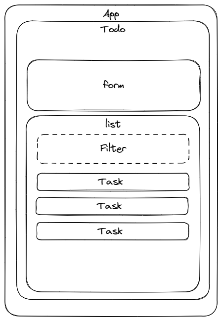
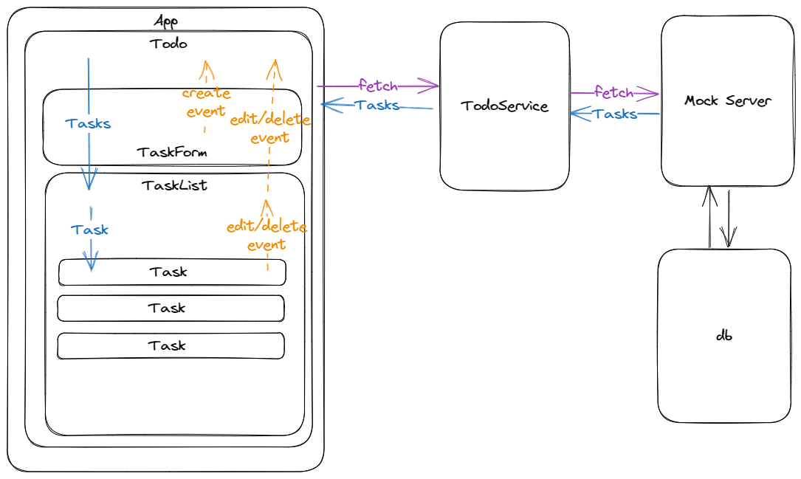

# Todo List

todo list practice.

## Architecture

### Component Structure

### Data-Flow

> excalidraw file: [architecture](readme-images/Architecture_2023-06-12.excalidraw)

## Resources

- Sound Effects: [Pixabay Sound Effects](https://pixabay.com/sound-effects/)
- MP3Cutter: [Online MP3 Cutter](https://mp3cut.net/tw/)

---

## Requirements

- Use any frontend frameworks of your choice(**Angular**, React, Vue, etc)
- Feel free to build the UI in your own way

### Test coverage

- [x] Can add tasks with a short description
- [x] Show a list of all tasks(completed/uncompleted)
- [x] Can set a task as completed or uncompleted
- [x] Can delete a task
- [x] Can update the task description
- [x] (optional) Can sort tasks by time the tasks are created
- [x] (optional) Can filter or search tasks
- [x] (optional) Make the UI responsive

### Submission

- Clean and extendable code
- Documentation (source code, architecture)
- [x] (optional) Live demo site

---

## Try something

- [x] Use commitizen for conventional commits
- [x] Use Tailwind for styling
- [x] Use Vercel to host site
- [x] Use SQL like solution to store data (IndexedDB, PonchDB)
- [x] Add PWA support
- [x] Add Sound Effects

---

## How to start

- Download the project.
- Run `npm init` with node enviroment.
- Run `npm start` to serve the web， open `http://localhost:4200` to see the result.

## How to commit messages

- Run commitizen by `npm run commit` to commit messages.
